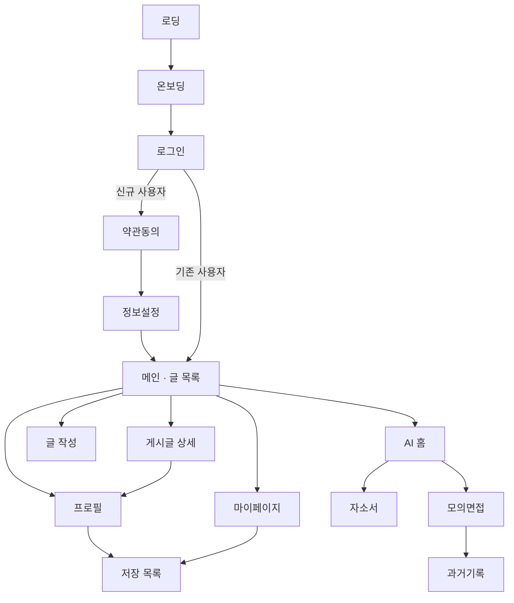

# 🍃 SPROUT

> AI와 함께 쌓아가는 커리어 아카이브
> EFUB SWS(Summer Web Surf) MANDO 팀 프로젝트

<p>
  
  
  
</p>

| 항목 | 링크 |
|:---|:---|
| 🌐 **서비스 바로가기** | [Vercel-SPROUT](https://sprout-efub.vercel.app/) |
| 🖥️ **Frontend Repository** | [EFUB-SWS-MANDO/Frontend](https://github.com/EFUB-SWS-MANDO/Frontend) |
| 📄 **Notion** | [SPROUT NOTION](https://app.notion.com/p/SPROUT-38fe46b1b00c8015a4a9d950cd4e229b?source=copy_link) |

**개발 기간** : 2026.07 ~ 2026.08

<br/>

## ☘️ 서비스 소개

**SPROUT**는 흩어져 있던 나의 경험을 한 곳에 기록하고, AI의 도움을 받아 자기소개서와 면접 준비까지 이어갈 수 있는 **AI 기반 커리어 아카이브 서비스**입니다.

대외활동, 프로젝트, 수상 이력 — 열심히 해냈지만 막상 자소서를 쓰려고 하면 기억이 나지 않습니다. SPROUT는 그 순간의 기록을 씨앗처럼 심어두고, 쌓인 기록이 새싹으로 자라는 과정을 시각화합니다. 그리고 필요한 순간, AI가 그 기록들을 엮어 자기소개서 초안과 예상 면접 질문을 만들어 줍니다.

<br/>

## 🍀 주요 기능

| 기능 | 설명 |
|:---|:---|
| **경험 아카이빙** | 활동·프로젝트·경험을 카테고리와 태그로 분류해 기록 |
| **피드 & 소셜** | 다른 사용자의 기록을 탐색하고 팔로우, 댓글로 소통 |
| **성장 시각화** | 누적 기록을 새싹 성장 단계와 통계 그래프로 확인 |
| **AI 자기소개서** | 아카이빙한 경험을 바탕으로 자소서 초안 생성 |
| **AI 모의 면접** | 작성한 기록·자소서 기반 예상 질문 및 피드백 제공 |
| **프로필** | 나의 기록 모아보기, 팔로워/팔로잉 관리 |

<br/>

## 👥 팀 구성

### Frontend

| 구분 | 🍥 최주희 | 🧸 오나연 |
| :--- | :--- | :--- |
| **Image** |  |  |
| **담당 영역** | 진입 · 인증 플로우, 메인 피드, AI 모의면접 | 마이페이지 · 프로필, 게시글 작성/상세, AI 자소서 |
| **GitHub** | [@dearosmar](https://github.com/dearosmar) | [@nayeon653](https://github.com/nayeon653) |

<br/>

## 🖥️ 뷰 분배

### 🍥 최주희

| 뷰 | 설명 |
|:---|:---|
| 로딩 → 온보딩 | 스플래시, 서비스 소개 온보딩 |
| 로그인 | 로그인 및 소셜 인증, `authStore` |
| 약관동의 | 가입 약관 동의 단계 |
| 정보설정 | 초기 프로필·관심사 설정 |
| 메인 (글 목록) | 홈 피드, 기록 리스트 |
| 모의면접 | AI 기반 예상 질문 및 피드백 |
| 과거기록 | 지난 면접·기록 히스토리 조회 |
| 저장 목록 | 스크랩한 기록 모아보기 |

### 🧸 오나연

| 뷰 | 설명 |
|:---|:---|
| 마이페이지 | 새싹 성장 단계, 통계 그래프 |
| 프로필 | 프로필 조회, 팔로우/팔로잉 |
| 게시글 상세 | 기록 상세, 댓글 |
| 글 작성 | 기록 작성 폼, 카테고리·태그 입력 |
| 자소서 | AI 자기소개서 생성 |

> `RootLayout`, `Navbar`, `components/` 하위 공통 UI, `styles/theme.js`는 초기 세팅 시 함께 정의합니다.

<br/>

## 🏗️ 프로젝트 설계

### 화면 흐름도



- 최초 진입 시 **로딩 → 온보딩**을 거치며, 재방문 사용자는 온보딩을 건너뜁니다.
- 로그인 이후 **가입 이력에 따라 분기**합니다. 신규 사용자만 약관동의·정보설정 단계를 지납니다.
- **메인(글 목록)이 모든 흐름의 허브**입니다. 하단 네비게이션을 통해 어느 화면에서든 돌아올 수 있습니다.
- AI 기능은 별도 진입점(AI 홈)에서 자소서·모의면접으로 나뉘고, 모의면접 결과는 과거기록에 누적됩니다.

### 아키텍처 원칙

- **페이지는 얇게, 도메인은 features로**
  `pages/`는 라우팅 진입점 역할만 하고, 실제 UI와 로직은 `features/` 하위 도메인 폴더에 둡니다.
- **API 호출은 커스텀 훅으로 캡슐화**
  컴포넌트가 axios를 직접 호출하지 않고, `features/*/api/`의 훅을 통해서만 서버와 통신합니다.
- **공통 컴포넌트는 진짜 공통만**
  두 개 이상의 도메인에서 쓰이는 UI만 `components/`에 올립니다. 한 도메인에서만 쓰면 해당 feature 안에 둡니다.
- **디자인 토큰 중앙 관리**
  색상·폰트·spacing은 `styles/theme.js`에서만 정의하고, 컴포넌트에서 하드코딩하지 않습니다.

### 데이터 흐름

```
Page
 └─ feature/components   (UI 렌더링)
      └─ feature/api     (커스텀 훅 - 서버 상태)
           └─ apis/axiosInstance  (baseURL · 토큰 인터셉터)

stores/  (zustand - 전역 클라이언트 상태: 인증 등)
```

<br/>

## 🔀 Git Flow

### 브랜치 전략

```
main        배포 가능한 안정 버전
 └─ develop      개발 통합 브랜치
      └─ feat/#3     기능 단위 작업 브랜치
      └─ fix/#7
      └─ network/#12
```

- 브랜치 이름: `종류/#이슈번호` (예: `feat/#3`)
- 브랜치 이름은 **소문자**로 작성합니다.
- 작업은 항상 `develop`에서 분기하고, PR도 `develop`으로 보냅니다.

### 작업 순서

1. 이슈 생성 → 이슈 번호 확인
2. `develop`에서 작업 브랜치 분기
3. 작업 & 커밋 (저장하는 느낌으로 **자주**)
4. `develop`으로 PR 생성 → 팀원 리뷰
5. Approve 후 merge → 브랜치 삭제

```bash
git checkout develop
git pull origin develop
git checkout -b feat/#3

# 작업 후
git add .
git commit -m "[feat] #3 홈 화면 ui 구현"
git push -u origin feat/#3
```

<br/>

## 🛠️ 기술 스택

| 구분 | 스택 |
|:---|:---|
| **Framework** | React (JavaScript) |
| **Build Tool** | Vite |
| **Routing** | react-router-dom |
| **HTTP** | axios (인스턴스 + 인터셉터) |
| **State** | Zustand |
| **Styling** | styled-components (theme) |
| **Convention** | ESLint, Prettier |

### 선택 이유

- **Vite** — CRA 대비 압도적으로 빠른 개발 서버와 빌드 속도
- **Zustand** — Redux보다 보일러플레이트가 적고, 짧은 프로젝트 기간에 러닝커브가 낮음
- **styled-components** — theme 기반 디자인 토큰 관리가 편하고, 컴포넌트 단위 스타일 캡슐화에 적합
- **axios 인터셉터** — 토큰 갱신과 공통 에러 처리를 한 곳에서 관리

<br/>

## 📁 폴더 구조

```
src/
├─ apis/
│  ├─ axiosInstance.js       # baseURL, 토큰 인터셉터
│  └─ endpoints.js           # API 경로 상수 모음
├─ components/               # 진짜 공통 UI만
│  ├─ Button/
│  ├─ Modal/
│  ├─ Input/
│  ├─ Tag/
│  ├─ Spinner/               # 로딩
│  └─ EmptyState/            # "아직 기록이 없어요 🌱"
├─ layouts/
│  ├─ RootLayout.jsx         # 네비게이션 바 + Outlet
│  └─ Navbar.jsx
├─ hooks/                    # 공통 커스텀 훅 (useDebounce 등)
├─ stores/                   # zustand (authStore.js)
├─ styles/
│  ├─ theme.js               # ★ 색·폰트·spacing 디자인 토큰
│  └─ GlobalStyle.js
├─ utils/                    # 날짜 포맷 등 순수 함수
├─ constants/                # 카테고리/태그 목록 등
├─ routes/
│  └─ router.jsx             # 라우트 정의 한 곳에
├─ pages/                    # 라우트 단위 페이지 (얇게 유지)
│  ├─ LoginPage.jsx
│  ├─ HomePage.jsx
│  ├─ PostDetailPage.jsx
│  ├─ PostWritePage.jsx
│  ├─ MyPage.jsx
│  ├─ ProfilePage.jsx
│  └─ ai/
│     ├─ AiHomePage.jsx
│     ├─ CoverLetterPage.jsx
│     └─ InterviewPage.jsx
└─ features/                 # ★ 도메인 로직·컴포넌트
   ├─ auth/
   ├─ post/
   │  ├─ api/                # usePosts.js (axios 호출 훅)
   │  ├─ components/         # PostCard, PostList, CommentList...
   │  └─ utils/
   ├─ profile/               # 팔로우, 프로필 카드
   ├─ mypage/                # 새싹, 통계 그래프
   └─ ai/                    # 자소서/면접 관련
```

<br/>

## 📌 컨벤션

### ⚡️ Issue

**제목** : `[종류] 작업이름` — 예) `[feat] HomeView UI 구현`

```markdown
## ☘️ Issue 내용

## 🍃 To Do
- [ ]
```

### ⑆ Branch

**이름** : `종류/#이슈번호` — 예) `feat/#3`
브랜치 이름은 소문자로 작성합니다.

### 🔁 Pull Request

**제목** : `[브랜치 역할] #이슈번호 이슈 제목과 동일` — 예) `[feat] #3 HomeView UI 구현`

```markdown
## ☘️ 작업한 이슈
- closed: #이슈번호

## 🍀 작업한 내용
<!-- 작업한 내용 적기 -->
- []

## 🍃 작업 포인트
<!-- 한 개 이상 강조하고 싶은 포인트 쓰기 -->

## 📷 GIF
| Feature | 시연 영상 |
|:--------:|:--------------:|
| 기능이름 |  |
```

### 💭 Commit

**메시지** : `[종류] #이슈번호 작업 이름` — 예) `[feat] #1 메인 ui 구현`

| Type | 설명 |
|:---|:---|
| `[feat]` | 새로운 기능 구현 ⭐️ |
| `[fix]` | 버그, 오류 해결 |
| `[chore]` | 코드 수정, 내부 파일 수정, 애매한 것들이나 잡일 ⭐️ |
| `[design]` | UI만 작업할 때 |
| `[docs]` | README나 WIKI 등의 문서 개정 |
| `[network]` | API 연동, 서버 통신 관련 작업 |
| `[merge]` | 작업 브랜치를 develop 브랜치에 merge 할 때 ⭐️ |

**규칙**
1. prefix는 소문자로 작성합니다.
2. `[prefix] #이슈번호` 형태로 고정합니다.
3. 이후 내용은 한글로 작성하되, 최대한 누가 봐도 이해할 수 있도록 작성합니다.
4. 커밋은 자주 하도록 합니다.

### 👀 Code Review

1. PR 작성 후 **Discord에 PR 작성했다고 알립니다.**
2. **코드래빗 리뷰를 먼저 반영한 뒤**, 팀원을 멘션해 코드 리뷰를 요청합니다.
3. PR에 대한 리뷰는 **최소 하나 이상** 달도록 합니다. (10줄 이하 변경은 제외)
4. 코드 리뷰는 **최대 3시간 내**에 답니다.
5. 코드 리뷰 완료 시 Discord 답글로 "코드 리뷰 완료"라고 알립니다.
6. **반드시 팀원의 Approve 이후 Merge합니다.**

### 💻 Code

**네이밍**

| 대상 | 규칙 | 예시 |
|:---|:---|:---|
| 변수 / 함수 | 카멜케이스 | `userName`, `fetchData()` |
| 컴포넌트 / 파일명 | 파스칼케이스 | `PostCard.jsx`, `RootLayout.jsx` |
| 커스텀 훅 | `use` 접두사 + 카멜케이스 | `usePosts`, `useDebounce` |
| Boolean | `is` / `has` / `should` 로 시작 | `isLoading`, `hasError` |
| 상수 | 대문자 스네이크케이스 | `MAX_COUNT`, `CATEGORY_LIST` |

<br/>

## 🔧 트러블슈팅

<!-- 작업하며 겪은 이슈를 기록하고 링크를 첨부해 주세요 -->

| 이슈 | 담당자 | 링크 |
|:---|:---:|:---:|
| | | |
| | | |

<br/>

## 🚀 실행 방법

```bash
# 의존성 설치
npm install

# 개발 서버 실행
npm run dev

# 프로덕션 빌드
npm run build
```

`.env` 파일이 필요합니다. 팀 노션의 환경변수 문서를 참고해 주세요.
